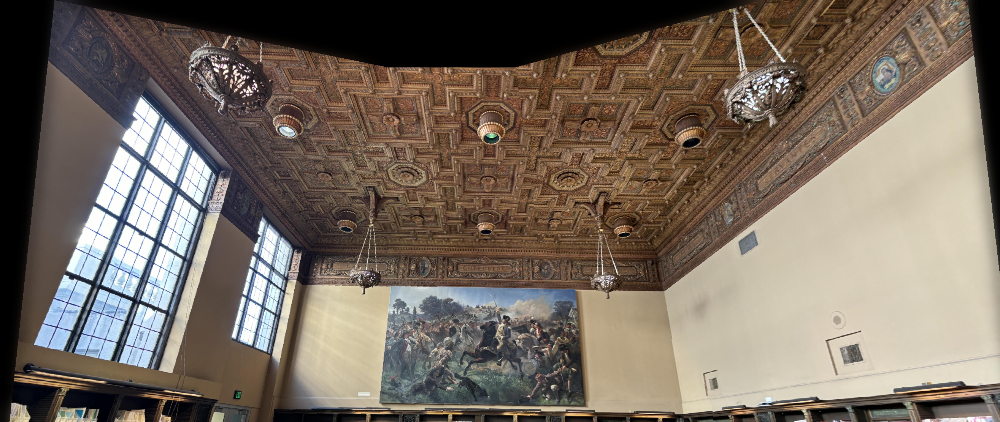

# Image Mosaic
A Python project that uses OpenCV and simple mathematics to create image mosaics. For a more in-depth view into this project, see [this blog post](https://tyeoh9.github.io/tyeoh/projects/cs180/project4/).

## Requirements
- OpenCV 4.10.0
- Python 3.12.5

## Usage
1. Install the required packages with `pip install -r requirements.txt`
2. Run the cells in the Jupyter notebook in main.ipynb to create an image mosaic using your own images

## Useful resources
- [OpenCV Documentation](https://docs.opencv.org/4.10.0/)
- [Homography Transformations](https://en.wikipedia.org/wiki/Homography_(computer_vision))
- [Laplacian Blending](https://en.wikipedia.org/wiki/Laplacian_of_Gaussian)
